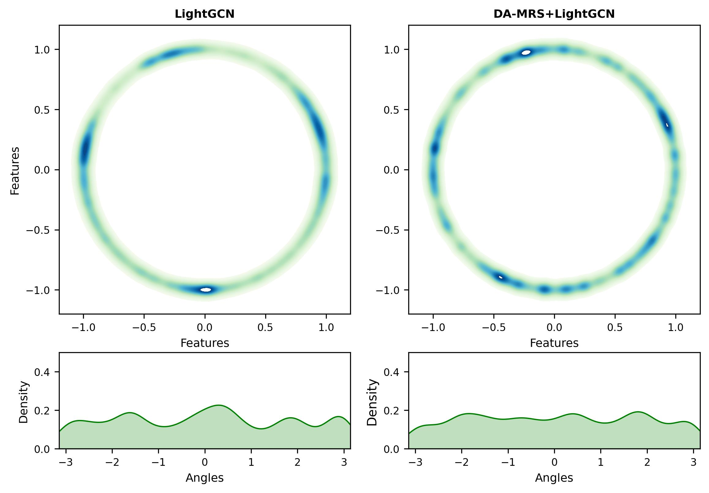
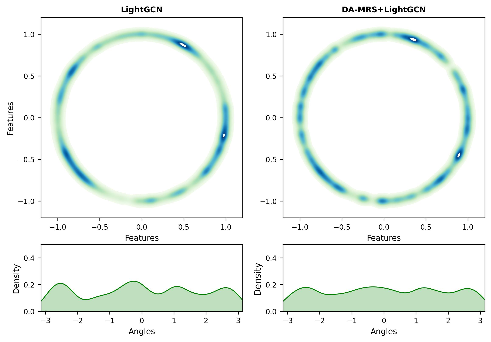
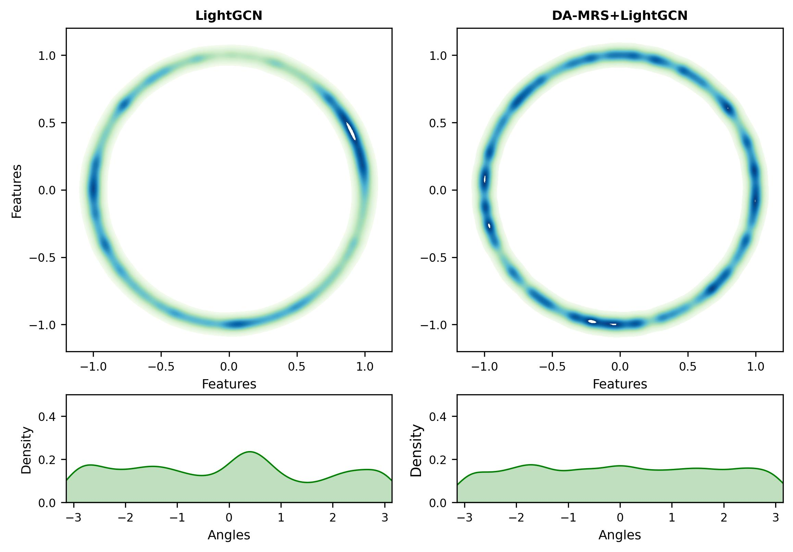
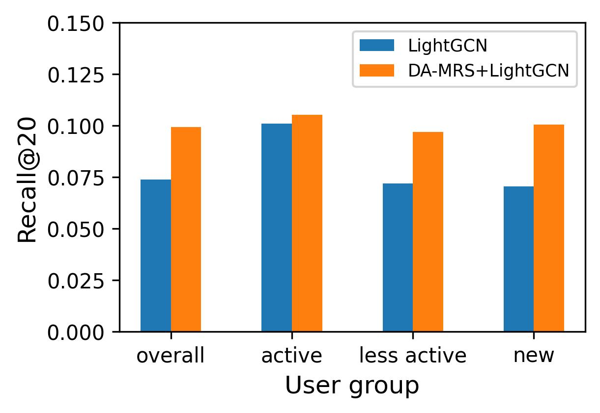
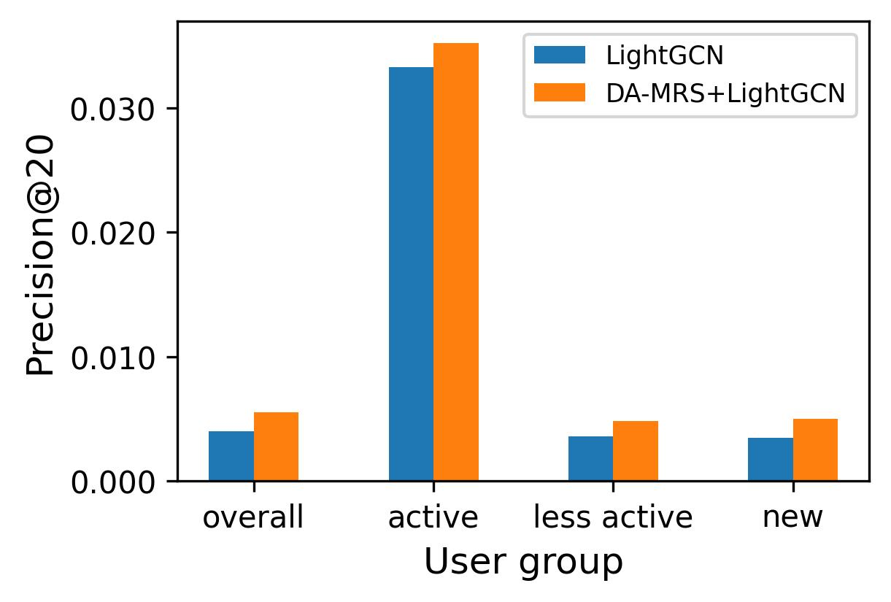
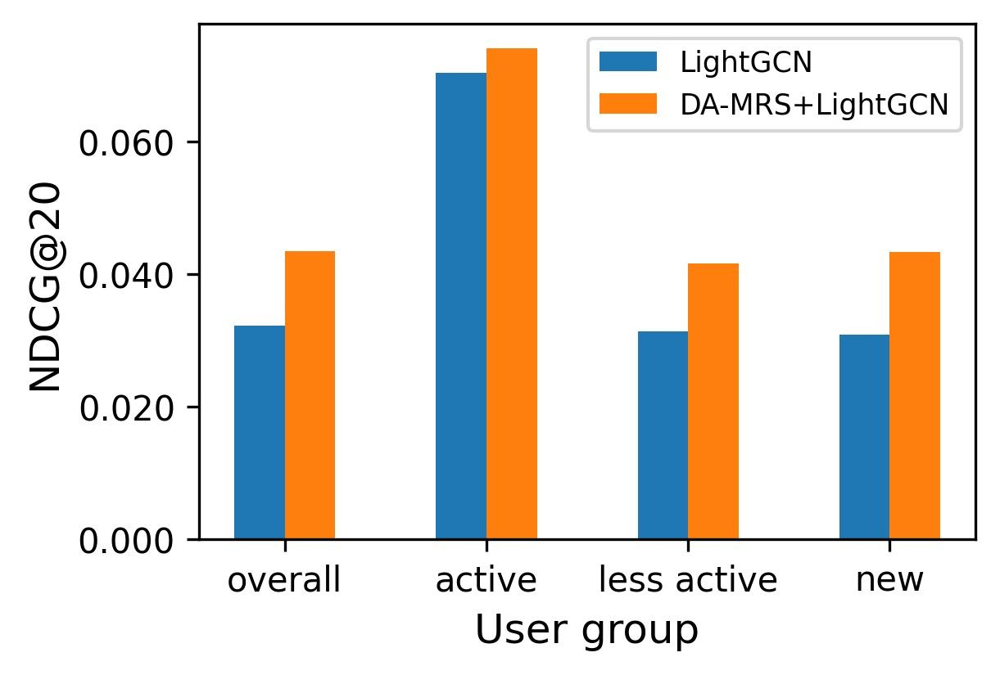

# DA-MRS

This repository contains our implementations for Denoising and Aligning Multi-modal Recommender System. 


### Folder structure

- data: The public links to download the datasets and dataset preprocessing methods. 
- log_files: The log files to quickly reproduce the reported results. 
- src: The implementation of DA-MRS and its baselines on Amazon Baby, Sports and Clothing. 
- src_cold_start: The Implementation of DA-MRS on the cold-start user testing experiment. 
- src_tiktok: The implementation of DA-MRS+LightGCN and its baselines on TikTok dataset. 
- visualization: The visualization of DA-MRS+LightGCN and LightGCN. 


### Dependencies

- OS: Ubuntu 20.04.6 LTS
- numpy==1.23.5
- pandas==1.5.3
- python==3.10.9
- scipy==1.10.0
- torch==2.0.0
- pyyaml==6.0
- pyg==2.3.0
- networkx==2.8.4
- tqdm==4.65.0
- lmdb==1.4.0


### Main Experiment

1. Step 1: Download and pre-process the datasets to folder './data' following the instruction in './data/Readme.md'.  

2. Step 2: Run the following command to construct item-item behavior graph. 

   ```python
   # construct item-item behavior graph. 
   
   python -u build_iib_graph.py --dataset=baby --topk=2
   ```

   There are two parameters:

   1. dataset: str type, allowed values are baby, sports, clothing, and tiktok.
   2. topk: int type, parameter for pruning the Item-item behavior graph.

   

3. Step 3: Specify configurations

   1. Enter to the './src' folder

      ```bash
      # enter to the src folder
      
      cd src
      ```

   2. Specify dataset-specific configurations

      ```bash
      vim configs/dataset/xx.yaml
      ```

   3. Specify model-specific configurations

      ```bash
      vim configs/model/xx.yaml
      ```

   4. Specify the overall configurations

      ```bash
      vim configs/overall.yaml
      ```

4. Step 4: Run the following command to train and evaluate the model. 

   ```python
   # run the code 
   
   python -u main.py --model=LightGCN --dataset=baby --gpu_id=0
   ```

   There are three parameters: 

   1. model: str type, the name of the **backbone model**, such as LightGCN. 

   2. dataset: str type, the name of the dataset, such as baby, sports, clothing.

   3. gpu_id: str type, the specified GPU. 


***We provide the log files of DA-MRS+LightGCN, DA-MRS+MFBPR, DA-MRS+VBPR, and all baselines on Amazon Baby, Sports, and Clothing datasets in the './log_files/main_results_log/' folder to help reproduce the results more quickly.***


### Visualization

***The visualization results are in the './src_visualization/image' folder.***

We produce two interpretative images.

1. The first image visualizes the item representations before (i.e., using LightGCN) and after denoising and aligning (i.e., using DA-MRS+LightGCN). Specifically, we project the learned item representations to 2-dimensional normalized vectors on a unit sphere (i.e., a circle with radius 1) by using t-SNE. All the representations are obtained when the methods reach their best performance.
2. Since all the projected representations are on the sphere, they only differ in the polar angle in a polar coordinate system. The second image plots the distribution of polar angles with the nonparametric Gaussian kernel density estimation [1].

As shown in the Figures 1-3:  

1. The first image illustrates that item representations obtained from LightGCN **are clustered on the circle** (i.e., a few segments on the circle include many points while others have a few points). Item representations from DA-MRS are **more evenly distributed on the sphere**. 

2. The second image illustrates that the polar angles before denoising mainly reside in some regions (i.e., the distribution has several peaks), and **the density distribution of polar angles is smoother after denoising and aligning**.

A more uniform representation distribution can improve the generalization ability [1]. This suggests the model can learn more universally effective item representations through DA-MRS. As the ablation study in Section 4.4 shows, DA-MRS achieves better recommendation performance.


We will add the visualization on the Baby, Sports, and Clothing datasets in the revision.


[1] Junliang Yu, Hongzhi Yin, Xin Xia, Tong Chen, Lizhen Cui, and Quoc Viet Hung Nguyen. 2022. Are Graph Augmentations Necessary? Simple Graph Contrastive&nbsp;Learning for Recommendation. In Proceedings of the 45th International ACM SIGIR Conference on Research and Development in Information Retrieval (SIGIR '22). Association for Computing Machinery, 1294–1303.



Figure 1: The visualization experiment on baby dataset. 




Figure 2: The visualization experiment on sports dataset. 




Figure 3: The visualization experiment on clothing dataset. 


### Cold Start Experiment

1. Step 1: Download and pre-process the datasets to folder './data' following the instruction in './data/Readme.md'.  

2. Step 2: Run the following command to construct item-item behavior graph. 

   ```python
   # construct item-item behavior graph. 
   
   python -u build_iib_graph.py --dataset=baby --topk=2
   ```

   There are two parameters:

   1. dataset: str type, allowed values are baby, sports, clothing, and tiktok.
   2. topk: int type, parameter for pruning the Item-item behavior graph.

   

3. Step 3: Specify configurations

   1. Enter to the './src_cold_start' folder

      ```bash
      # enter to the src folder
      cd src_cold_start
      ```

   2. Specify dataset-specific configurations

      ```bash
      vim configs/dataset/xx.yaml
      ```

   3. Specify model-specific configurations

      ```bash
      vim configs/model/xx.yaml
      ```

   4. Specify the overall configurations

      ```bash
      vim configs/overall.yaml
      ```

   5. Divide user groups

      **In ./src_cold_start/utils/dataset.py , lines 70-74**, we can divide user groups. 

   ```python
    a = self.df['userID'].value_counts()   
    warm = a[a>=50].index.tolist()  # set the active user group
    cold = a[a==5].index.tolist()   # set the new user group 
    dfs.append(dfs[2][dfs[2]['userID'].isin(warm)])
    dfs.append(dfs[2][dfs[2]['userID'].isin(cold)])
   ```

4. Step 4: Run the following command to train and evaluate the model. 

   ```python
   # run the code 
   python -u main.py --model=LightGCN --dataset=baby --gpu_id=0
   ```

   There are three parameters: 

   1. model: str type, the name of the backbone model, such as LightGCN and MF.

   2. dataset: str type, the name of the dataset, such as baby, sports, clothing, and tiktok.

   3. gpu_id: str type, the specified GPU. 

      

5. **We provide the logs of DA-MRS+LightGCN and LightGCN in the './log_files/cold_start_log' folder.** 

   - DA-MRS+LightGCN-baby-Dec-10-2023-17-46-27.log: The results of the *active user group* and *the less active user group*. 
   - DA-MRS+LightGCN-baby-Dec-10-2023-18-18-27.log: The results of the *active user group* and the *new user group*. 
   - LightGCN-baby-Dec-10-2023-16-57-36.log: The results of the *active user group* and the *new user group*. 
   - LightGCN-baby-Dec-10-2023-18-20-02.log: The results of the *active user group* and the *less active user group*. 

6. To verify the impact of DA-MRS on new users, we divide the users in the Baby dataset into multiple groups and test the results in the active user group (with more than 50 interactions), less active user group (with less than 10 interactions), and new user group (with 5 interactions, note that the dataset is 5-core). There are a total of 27 active users, 15,063 less active users, and 5,998 new users. We use R@20, P@20, and N@20 as metrics to evaluate LightGCN and DA-MRS+LightGCN. We plot the results on baby datasets in Figure 4-6. 



Figure 4: The Recall@20 on different user groups. 



Figure 5: The Precision@20 on different user groups. 



Figure 6: The NDCG@20 on different user groups. 

   From Figure 4-6, we have the following observations:
   1. DA-MRS consistently outperforms LightGCN in all user groups. DA-MRS achieves a significant improvement on all user groups. This indicates that DA-MRS effectively captures the preferences of various users and provides more accurate recommendation results.
   2. The performance improvement of DA-MRS on the less active user group and new user group is much greater than that on the active users group. Due to a lack of feedback data, conventional collaborative filtering methods face challenges in providing accurate recommendations for the less active user group and new user group. However, DA-MRS leverages multi-modal content to denoise and align feedback behavior, which effectively overcomes data sparsity issues, significantly benefits less active users, and successfully addresses the cold/new user problem.
   3. DA-MRS performs even better in the new user group compared to the less active user group. This is possible because DA-MRS has effectively alleviated the issue of data sparsity. Although cold users have fewer interactions, their interests are more concentrated, allowing for more accurate modeling of user preferences and improved recommendation performance.
   Therefore, DA-MRS is not affected by new users and can effectively address the new user problem. 


### TikTok Dataset

1. Step 1: Download and pre-process the datasets to folder './data' following the instruction in './data/Readme.md'.  

2. Step 2: Run the following command to construct item-item behavior graph. 

   ```python
   # construct item-item behavior graph. 
   
   python -u build_iib_graph.py --dataset=tiktok --topk=2
   ```

   There are two parameters:

   1. dataset: str type, allowed values are baby, sports, clothing, and tiktok.

   2. topk: int type, parameter for pruning the Item-item behavior graph.

      

3. Step 3: Specify configurations

   1. Enter to the './src_tiktok' folder

      ```bash
      # enter to the src_tiktok folder
      cd src_tiktok 
      ```

   2. Specify dataset-specific configurations

      ```bash
      vim configs/dataset/xx.yaml
      ```

   3. Specify model-specific configurations

      ```bash
      vim configs/model/xx.yaml
      ```

   4. Specify the overall configurations

      ```bash
      vim configs/overall.yaml
      ```

      

4. Step 4: Run the following command to train and evaluate the model. 

   ```python
   # run the code 
   python -u main.py --model=LightGCN --dataset=baby --gpu_id=0
   ```

   There are three parameters: 

   1. model: str type, the name of the backbone model, such as LightGCN. 

   2. dataset: str type, the name of the dataset, such as baby, sports, clothing, and tiktok.

   3. gpu_id: str type, the specified GPU. 

      

5. **We provide the logs of DA-MRS+LightGCN and other baselines in the './log_files/main_results_log/tiktok' folder.** 


### Noisy scenarios experiments

1. Step 1: Download and pre-process the datasets to folder './data' following the instruction in './data/Readme.md'.  

2. Step 2: Run the following command to construct item-item behavior graph. 

   ```python
   # construct item-item behavior graph. 
   
   python -u build_iib_graph.py --dataset=baby --topk=2
   ```

   There are two parameters:

   1. dataset: str type, allowed values are baby, sports, clothing, and tiktok.
   2. topk: int type, parameter for pruning the Item-item behavior graph.

   

3. Step 3: Run the following command to construct noisy scenarios. 

   ```python
   # construct noisy modality scenarios. 
   python -u replace_modality.py
   
   # add noisy feedback 
   python -u add_neg_inter.py
   
   # remove noisy feedback
   python -u delete_inter.py
   ```

4. Step 4: Specify configurations

   1. Enter to the './src' folder

      ```bash
      # enter to the src folder
      cd src
      ```

   2. Specify dataset-specific configurations

      ```bash
      vim configs/dataset/xx.yaml  Lines 9-13
      ```

      ```python
      inter_file_name: 'baby.inter' # select noisy feedback scenarios
      
      # name of features
      vision_feature_file: 'image_feat.npy' # select noisy visual content scenarios
      text_feature_file: 'text_feat.npy' # select noisy textual content scenarios
      ```

   3. Specify model-specific configurations

      ```bash
      vim configs/model/xx.yaml
      ```

   4. Specify the overall configurations

      ```bash
      vim configs/overall.yaml
      ```

5. Step 4: Run the following command to train and evaluate the model. 

   ```python
   # run the code 
   python -u main.py --model=LightGCN --dataset=baby --gpu_id=0
   ```

   There are three parameters: 

   1. model: str type, the name of the **backbone model**, such as LightGCN. 

   2. dataset: str type, the name of the dataset, such as baby, sports, clothing.

   3. gpu_id: str type, the specified GPU. 

      


### Ablation Study and Parameter Study

**By modifying the corresponding model parameters, experiments can be conducted. The experimental steps are consistent with the main experiment. We provide the running logs of all experiments.**

- ./log_files/Ablation_log: Running logs of the **ablation studies** on the Baby, Sports and Clothing dataset. 
- ./log_files/CL_experiment_log:  Running logs of the experiments that investigate the effects of **different strategies to select positive and negative samples** on the Baby dataset. 
- ./log_files/IIB_experiment_log: Running logs of the experiments that investigate the effects of **different interaction deletion threshold** on the Baby dataset. 
- ./log_files/KNN_parameter_log: Running logs of the experiments in Appendix A.4.1, which investigates the effects of the **number of k in DIIG.** 
- ./log_files/Loss_ai_parameter_log: Running logs of the experiments in Appendix A.4.3, which investigates the effects of **weight of** $L_{AI}$. 
- ./log_files/Loss_au_parameter_log: Running logs of the experiments in Appendix A.4.2, which investigates the effects of **weight of** $L_{AU}$. 


### Acknowledgement

The structure of this code is based on [MMRec](https://github.com/enoche/MMRec). Thanks for their work.