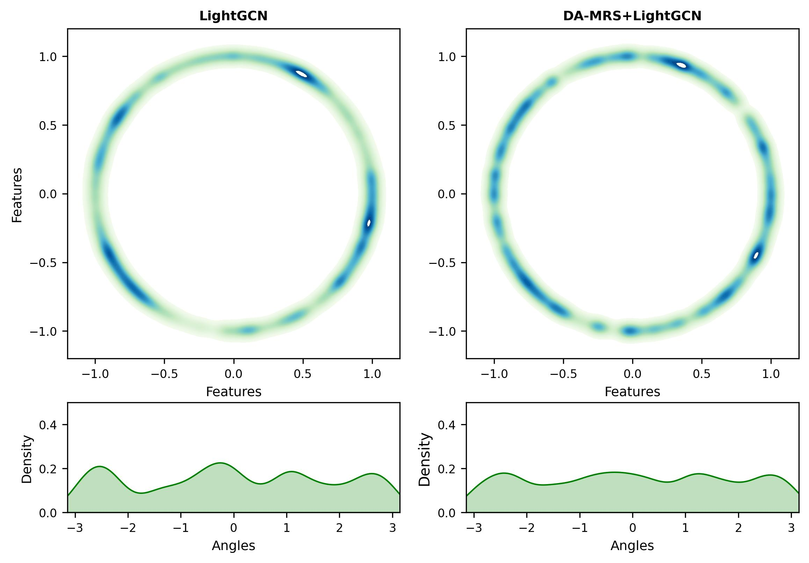

### Visualization

**The visualization results are in the “./image” folder.**

We produce two interpretative images.
   1. The first image visualizes the item representations before (i.e., using LightGCN) and after denoising and aligning (i.e., using DA-MRS+LightGCN). Specifically, we project the learned item representations to 2-dimensional normalized vectors on a unit sphere (i.e., a circle with radius 1) by using t-SNE. All the representations are obtained when the methods reach their best performance.
   2. Since all the projected representations are on the sphere, they only differ in the polar angle in a polar coordinate system. The second image plots the distribution of polar angles with the nonparametric Gaussian kernel density estimation [1].

As shown in the Figures:  
1. The first image illustrates item representations obtained from LightGCN *are clustered on the circle* (i.e., a few segments on the circle include many points while other segments include a few points). Item representations from DA-MRS are *more evenly distributed on the sphere*. 
2. The second image illustrates that the polar angles before denoising mainly reside in some regions (i.e., the distribution has several peaks), and *the density distribution of polar angles is smoother after denoising and aligning*.

A more uniform representation distribution can improve the generalization ability [1]. This suggests the model can learn more universally effective item representations through DA-MRS. As the ablation study in Section 4.4 shows, DA-MRS achieves better recommendation performance.

We will add the visualization on the Baby, Sports, and Clothing datasets in the revision.

[1] Junliang Yu, Hongzhi Yin, Xin Xia, Tong Chen, Lizhen Cui, and Quoc Viet Hung Nguyen. 2022. Are Graph Augmentations Necessary? Simple Graph Contrastive&nbsp;Learning for Recommendation. In Proceedings of the 45th International ACM SIGIR Conference on Research and Development in Information Retrieval (SIGIR '22). Association for Computing Machinery, 1294–1303.

Figure 1: The visualization experiment on baby dataset. 

Figure 2: The visualization experiment on sports dataset. 

Figure 3: The visualization experiment on clothing dataset. 
